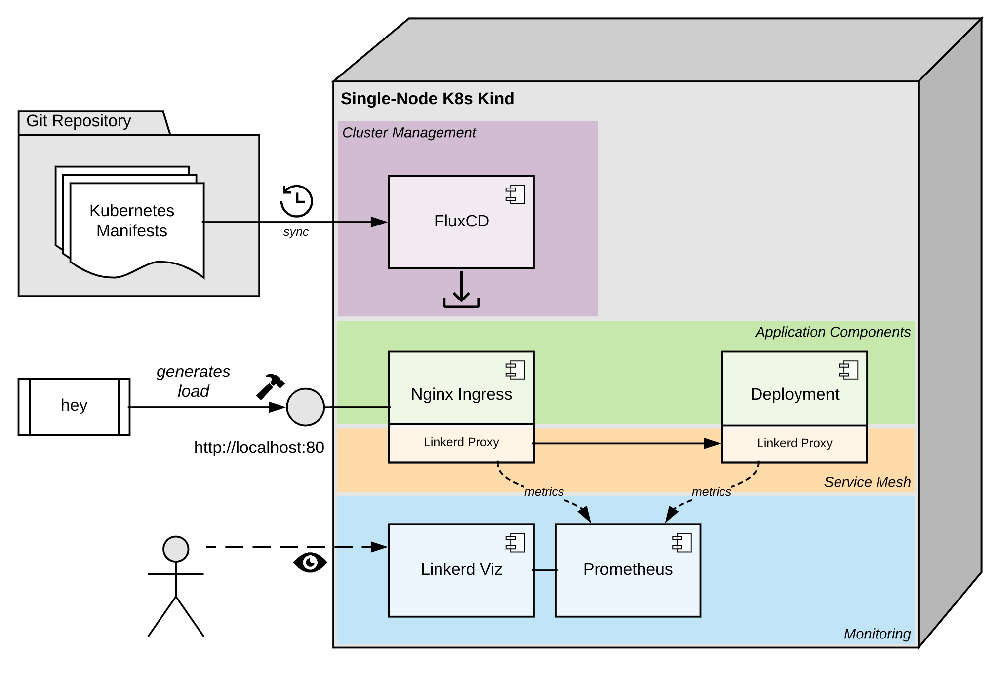
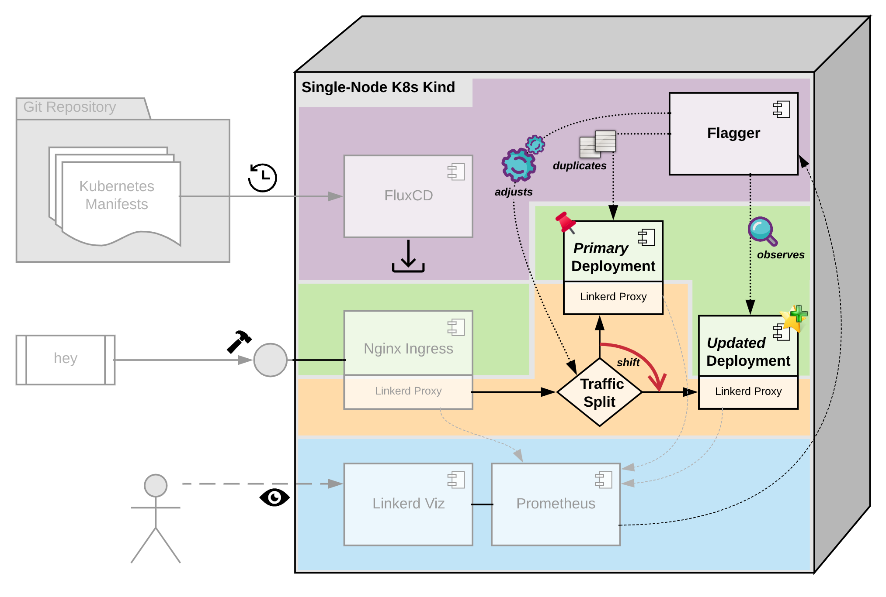

# Automated Canary Deployment Example

Setup uses:

* **K8s Kind** as local Kubernetes environment
* **FluxCD** and a **GitHub** repository for managing the cluster
* **Linkerd** service mesh for traffic management and observability
* **Flagger** for reliable releasing
* **Prometheus** because there's no reason for not using it
* **hey** to get some traffic
* **𝕰𝖝𝖆𝖒𝖎𝖓𝖊𝖗** just another simple test app

## Setup

To reproduce the example project please walk through the following steps

### Fork and clone the example

Create a fork of this repository, clone it to your local machine and change into its directory.
The following is expected to be executed within there.

### Local k8s kind cluster

[Install k8s kind](https://kind.sigs.k8s.io/docs/user/quick-start/#installation) or use the Kubernetes distribution you prefer.

```shell
# Create new cluster and configure kubectl
# depending on your system setup you may need to run the kind commands als privileged user or with `sudo`
kind create cluster --config ./_kind/config.yaml --image=kindest/node:v1.24.0
kind export kubeconfig --kubeconfig $HOME/.kube/config

### Output will be something like:
# Creating cluster "kind" ...
#  ✓ Ensuring node image (kindest/node:v1.24.0) 🖼
#  ✓ Preparing nodes 📦
#  ✓ Writing configuration 📜
#  ✓ Starting control-plane 🕹️
#  ✓ Installing CNI 🔌
#  ✓ Installing StorageClass 💾
# Set kubectl context to "kind-kind"
# You can now use your cluster with:
#
# kubectl cluster-info --context kind-kind
#
# Not sure what to do next? 😅  Check out https://kind.sigs.k8s.io/docs/user/quick-start/
# Set kubectl context to "kind-kind"
```

### Flux

[Install flux cli](https://fluxcd.io/docs/cmd/#install-using-bash) for bootstrapping FluxCD, the GitOps operator synchronizing the K8s manifests into your cluster.

```shell
# Initialize the cluster and configure synchronization from git repository
export GITHUB_TOKEN= # your github personal access token with repository scope
export REPO_OWNER=heubeck # replace with your github account
export REPO_NAME=cloudland-canary
flux bootstrap github \
  --owner=$REPO_OWNER \
  --repository=$REPO_NAME \
  --private=false \
  --personal=true \
  --path=bootstrap \
  --branch=main

### Output (shrinked):
# ► connecting to github.com
# ► cloning branch "main" from Git repository "https://github.com/heubeck/cloudland-canary.git"
# ✔ cloned repository
# ► generating component manifests
# ✔ generated component manifests
# ✔ component manifests are up to date
# ► installing components in "flux-system" namespace
# ✔ installed components
# ✔ reconciled components
#  ...
# ◎ waiting for Kustomization "flux-system/flux-system" to be reconciled
# ✔ Kustomization reconciled successfully
# ► confirming components are healthy
# ✔ helm-controller: deployment ready
# ✔ kustomize-controller: deployment ready
# ✔ notification-controller: deployment ready
# ✔ source-controller: deployment ready
# ✔ all components are healthy
```

The bootstrap command may vary on a different constellation, like with an organization or non-public repostory. Please check the Flux documentation.

It will last some minutes for the cluster components to become ready. You can check for completion and validate the setup by looking into Flux' Kustomization resources:

```shell
# We are ready to go as soon as all listed kustomization resources are `READY`
kubectl get kustomization -A

### Output as soon as everything is ready:
# NAMESPACE     NAME                     AGE     READY   STATUS
# flux-system   apps                     3m31s   True    Applied revision: main/71a913a6c2020e976917eecfc3267405a610410e
# flux-system   flux-system              3m58s   True    Applied revision: main/71a913a6c2020e976917eecfc3267405a610410e
# flux-system   infrastructure-layer-1   3m31s   True    Applied revision: main/71a913a6c2020e976917eecfc3267405a610410e
# flux-system   infrastructure-layer-2   3m31s   True    Applied revision: main/71a913a6c2020e976917eecfc3267405a610410e
```

### Linkerd

The linkerd cli is not mandatory, but eases access to its dashboard and helps with troubleshooting.

* [Install linkerd cli](https://linkerd.io/2.11/getting-started/#step-1-install-the-cli)
* [Install linkerd smi extension](https://linkerd.io/2.11/tasks/linkerd-smi/)

### hey

[hey](https://github.com/rakyll/hey) is a simple but efficient load producer.

### Access components

* [Examiner](https://github.com/heubeck/examiner) - Bound to ingress: GET http://localhost/examine
* Prometheus - Port forwarding: `kubectl port-forward -n monitoring svc/prometheus-operated 9090:9090`
* Linkerd Viz - Port forwarding: `kubectl port-forward -n linkerd-viz svc/web 8084:8084` or via cli: `linkerd viz dashboard`

## Overview

### Ordinary setup without canary deployment automation



### Enhanced setup for automated canary deployments



## Walkthrough

The following steps will demonstrate the example setup.

### Look what we got

```shell
kubectl  get deployment -A

### Output:
# NAMESPACE            NAME                                     READY   UP-TO-DATE   AVAILABLE   AGE
# apps                 examiner                                 1/1     1            1           83m
# flagger              flagger                                  1/1     1            1           87m
# flux-system          helm-controller                          1/1     1            1           87m
# flux-system          kustomize-controller                     1/1     1            1           87m
# flux-system          notification-controller                  1/1     1            1           87m
# flux-system          source-controller                        1/1     1            1           87m
# ingress              ingress-nginx-controller                 1/1     1            1           84m
# kube-system          coredns                                  2/2     2            2           88m
# linkerd-smi          smi-adaptor                              1/1     1            1           84m
# linkerd-viz          grafana                                  1/1     1            1           84m
# linkerd-viz          metrics-api                              1/1     1            1           84m
# linkerd-viz          prometheus                               1/1     1            1           84m
# linkerd-viz          tap                                      1/1     1            1           84m
# linkerd-viz          tap-injector                             1/1     1            1           84m
# linkerd-viz          web                                      1/1     1            1           84m
# linkerd              linkerd-destination                      1/1     1            1           87m
# linkerd              linkerd-identity                         1/1     1            1           87m
# linkerd              linkerd-proxy-injector                   1/1     1            1           87m
# local-path-storage   local-path-provisioner                   1/1     1            1           88m
# monitoring           prometheus-operator-kube-p-operator      1/1     1            1           86m
# monitoring           prometheus-operator-kube-state-metrics   1/1     1            1           86m
```

### View the linkerd dashboard

```shell
# Creates some port-forwards and blocks, run in a separate shell
linkerd viz dashboard
```

### Let some requests flow

```shell
# GET requests: 5 concurrently (-c), with a quote limit of 5 op/s (-q) over the next 60 minutes (-z)
# The 𝕰𝖝𝖆𝖒𝖎𝖓𝖊𝖗 will respond with a random delay between 100 and 250 milliseconds for simulating some real processing
hey -c 5 -q 5 -z 60m "http://localhost/examine?delay=100..250"
```

Explore the linkerd dashboard, look into the Grafana boards provided by linkerd.

### Ordinary rolling release of new version

Modify the [examiner HelmRelease](cluster/apps/examiner.yaml) with some new ECHO_VALUE configuration.
Commit and push the change for triggering the deployment.

```shell
### Current pod(s) handles all the traffic
# NAME                        READY   STATUS    RESTARTS   AGE
# examiner-69c69c89bd-2kmb7   2/2     Running   0          5m41s

### Deployment increases revision, new pod(s) starts
# NAME                        READY   STATUS            RESTARTS   AGE
# examiner-565c867bb4-zl79h   0/2     PodInitializing   0          2s
# examiner-69c69c89bd-2kmb7   2/2     Running           0          5m43s

### New pod(s) takes over all traffic immediately at the moment they're becoming READY
# NAME                        READY   STATUS        RESTARTS   AGE
# examiner-565c867bb4-zl79h   2/2     Running       0          4s
# examiner-69c69c89bd-2kmb7   2/2     Terminating   0          5m45s

### New pod(s) left alone after just 6 seconds
# NAME                        READY   STATUS    RESTARTS   AGE
# examiner-565c867bb4-zl79h   2/2     Running   0          6s
```

### Create `Canary` resource for Flagger configuration

Update the [examiner HelmRelease](cluster/apps/examiner.yaml) like this:

```yaml
spec:
  values:
    canary:
      enabled: true
```

Commit and push the change for taking effect.

### Flagger duplicates the deployment and its dependencies like ConfigMaps, secrets or HPA

```shell
### our placed deployment is inactive, the copy ("-primary") took over
# NAME               READY   UP-TO-DATE   AVAILABLE   AGE
# examiner           0/0     0            0           115m
# examiner-primary   1/1     1            1           3m56s

### same with referenced ConfigMap
# NAME               DATA   AGE
# examiner           1      117m
# examiner-primary   1      6m15s
```

### Flagger instructed Linkerd to route all traffic to its own copy of our deployment

The following TrafficSplit resource is generated and configured by Flagger:

```yaml
apiVersion: split.smi-spec.io/v1alpha2
kind: TrafficSplit
metadata:
  name: examiner
  namespace: apps
spec:
  backends:
  - service: examiner-canary
    weight: "0"
  - service: examiner-primary
    weight: "100"
  service: examiner
```

Explore the linkerd dashboard to see the effect.

### First automated canary deployment

Modify the [examiner HelmRelease](cluster/apps/examiner.yaml) again with some new ECHO_VALUE configuration.
Commit and push the change.

### View the magic happen

Look at the linkerd dashboard:
* Deployments in *apps* namespace
* Traffic Splits
* Ingress pod visualization

And the Grafana board: "Linkerd Namespace" for *apps*

### Start another deployment

Modify the [examiner HelmRelease](cluster/apps/examiner.yaml) again with some new ECHO_VALUE configuration.
Commit and push the change.

### Produce some error rate

After the deployment has started, produce some load that results in http 500s:

```shell
# Instruct the examiner to respond with http 500 over the next 4 minutes
hey -c 2 -q 2 -z 4m "http://localhost/examine?delay=100..500&status=500"
```

### Observe what happens

See the error rates in the linkerd dashboard. (Ignore the error rate on the -primary deployment, as this is a side effect of our load-test setup.)

Have a look into the Flagger event notification for our deployment:

```shell
# stream logs of the pod where Flagger is configured to send all events about or canary resource to
kubectl logs -f -n monitoring -l app.kubernetes.io/name=logger

### Output shows the begin of the deployment, the detected error rate and the abort of the deployment:
# {"name":"examiner","namespace":"apps","phase":"Initializing","metadata":{"eventMessage":"Initialization done! examiner.apps","eventType":"Normal","timestamp":"1655463741340"}}
# {"name":"examiner","namespace":"apps","phase":"Progressing","metadata":{"eventMessage":"New revision detected! Scaling up examiner.apps","eventType":"Normal","timestamp":"1655464101281"}}
# {"name":"examiner","namespace":"apps","phase":"Progressing","metadata":{"eventMessage":"Advance examiner.apps canary weight 5","eventType":"Normal","timestamp":"1655464131283"}}
#
# {"name":"examiner","namespace":"apps","phase":"Progressing","metadata":{"eventMessage":"Halt examiner.apps advancement success rate 91.60% \u003c 99%","eventType":"Warning","timestamp":"1655464191265"
# }}
# ...
# {"name":"examiner","namespace":"apps","phase":"Progressing","metadata":{"eventMessage":"Rolling back examiner.apps failed checks threshold reached 5","eventType":"Warning","timestamp":"1655464371265"}}
# {"name":"examiner","namespace":"apps","phase":"Failed","metadata":{"eventMessage":"Canary failed! Scaling down examiner.apps","eventType":"Warning","timestamp":"1655464371280"}}
```

### There's more to discover

* Custom metric templates
* Flagger alerts
* Canary Webhooks
* Automated loadtesting for low traffic environments
* Comparison of the performance of primary and canary deployment
* Better resource utilization and even smoother 'handover' by traffic shift up to 100% and appropriate HPA settings

## Cleanup

```shell
# Stop and remove the kind cluster
kind delete cluster
```

---

Congratulations. You made it to the end. Happy watching to your automated deployments.
